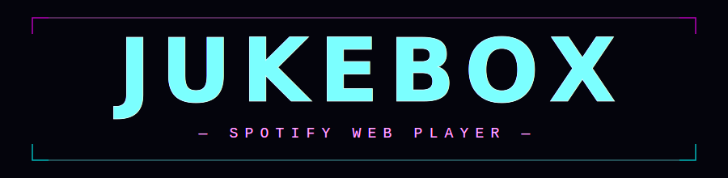
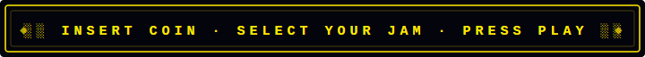

<div align="center">



<br/>




[](https://paypal.me/theboss3dfactory/)

</div>

<br/>

## ✨ Features

- **🎵 Full Spotify Playback** — Play, pause, skip, shuffle, repeat, volume, seek
- **💿 Vinyl Record Player** — Realistic spinning vinyl with grooves, tonearm, LED ring, turntable chassis
- **🎤 Live Synced Lyrics** — Karaoke-style lyrics from [lrclib.net](https://lrclib.net), click any line to seek
- **🔍 Search** — Find songs, artists, albums, playlists
- **📋 Browse** — Your playlists, top artists, new releases, genres
- **🔊 Smart Speaker Selection** — Switch between Spotify Connect devices, or connect Home Assistant to unlock Cast & Sonos speakers
- **🏠 Home Assistant Integration** — Optional HA connection stores settings in localStorage; transfers playback via `media_player.play_media` (works for sleeping Cast/Sonos devices)
- **👥 Multi-User** — Switch Spotify accounts with one click
- **🕹️ Cyberpunk Aesthetic** — Neon pink/cyan/purple theme, bokeh background, animated marquee, neon sidebar
- **📱 Responsive** — Works on desktop, tablet, and mobile

## 🚀 Setup

### 1. Create a Spotify App

1. Go to [Spotify Developer Dashboard](https://developer.spotify.com/dashboard)
2. Create a new app
3. Add your redirect URI (e.g., `http://your-ha-ip:8123/local/jukebox/index.html`)
4. Note your **Client ID** and **Client Secret**

### 2. Configure

Edit `app.js` and replace the placeholders:

```javascript
const CONFIG = {
  clientId: 'YOUR_SPOTIFY_CLIENT_ID',
  clientSecret: 'YOUR_SPOTIFY_CLIENT_SECRET',
  redirectUri: 'YOUR_REDIRECT_URI',
  ...
};
```

Optionally, set a `FALLBACK_REFRESH_TOKEN` (near the bottom of `app.js`) to skip the login screen. You can get this from an existing SpotifyPlus integration in Home Assistant, or by completing the auth flow once and checking `localStorage`.

### 3. Build

The app is two files: `template.html` (markup + CSS) and `app.js` (all logic). To create a single combined file:

```bash
python3 -c "
with open('template.html') as f: html = f.read()
with open('app.js') as f: js = f.read()
out = html.replace('</body>', '<script>' + js + '</script></body>')
open('index.html', 'w').write(out)
"
```

### 4. Deploy to Home Assistant

```bash
# Copy to HA's www directory
cp combined.html /path/to/homeassistant/www/jukebox/index.html

# Add a dashboard in HA (Settings → Dashboards → Add Dashboard)
# Or add to configuration.yaml:
panel_iframe:
  jukebox:
    title: "Jukebox"
    url: "/local/jukebox/index.html"
    icon: "mdi:music-box"
    require_admin: false
```


### Optional: Home Assistant Speaker Integration

The default speaker button shows active Spotify Connect devices. Google Cast and Sonos speakers only appear when actively in use.

To unlock your **full speaker list** (including sleeping Cast/Sonos devices):

1. Generate a **Long-Lived Access Token** in HA → Profile → Security
2. Install [SpotifyPlus](https://github.com/thlucas1/homeassistantcomponent_spotifyplus) (HACS)
3. Click **⚙** in the jukebox top bar and enter:
   - HA URL (e.g. `http://192.168.1.100:8123`)
   - Long-lived access token
   - SpotifyPlus entity ID (e.g. `media_player.spotifyplus_yourname`)
4. Update `CONFIG.homeSpeakers` in `app.js` with your speaker entity IDs:

```javascript
homeSpeakers: [
  { label: 'Living Room', icon: '🏠', entityId: 'media_player.living_room_speaker' },
  { label: 'Bedroom',     icon: '🛏', entityId: 'media_player.bedroom_speaker' },
],
```

Settings are stored in **browser localStorage** — nothing is saved in the code.

### 5. Standalone Use

Just open `combined.html` in any browser. No server required — it's a pure client-side app.

## 🎨 Screenshots

### Home View
Three-column layout with your top tracks, recently played, and top artists.

### Now Playing — Vinyl View
Spinning vinyl record with album art, tonearm animation, LED ring, synced lyrics with karaoke highlighting.

### Search
Full search across songs, artists, albums, and playlists.

### Genres
Browse by genre with Spotify category images.

## 🏗️ Architecture

- **Pure HTML/CSS/JS** — No frameworks, no build tools, no dependencies
- **Spotify Web API** — Authorization Code flow with client secret
- **lrclib.net** — Free lyrics API (synced + plain text)
- **Single file deploy** — Template + JS combined into one HTML file

## 📄 License

**All Rights Reserved** — You can view the code and use it for your own personal setup, but you cannot copy, redistribute, sell, or claim it as your own. See [LICENSE](LICENSE) for details.

## 🙏 Credits

- Built with [Spotify Web API](https://developer.spotify.com/documentation/web-api)
- Lyrics from [lrclib.net](https://lrclib.net)
- Designed for [Home Assistant](https://www.home-assistant.io/)

---

<div align="center">

## ☕ Support

If you enjoy this project, a coffee keeps the neon lights on!

[](https://paypal.me/theboss3dfactory/)

</div>
